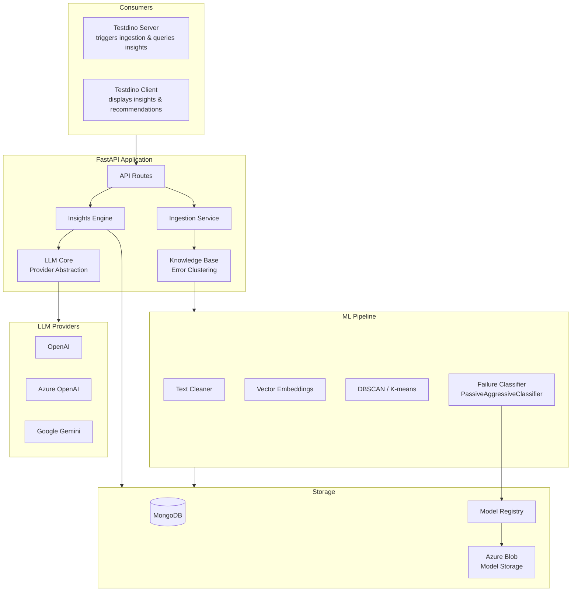
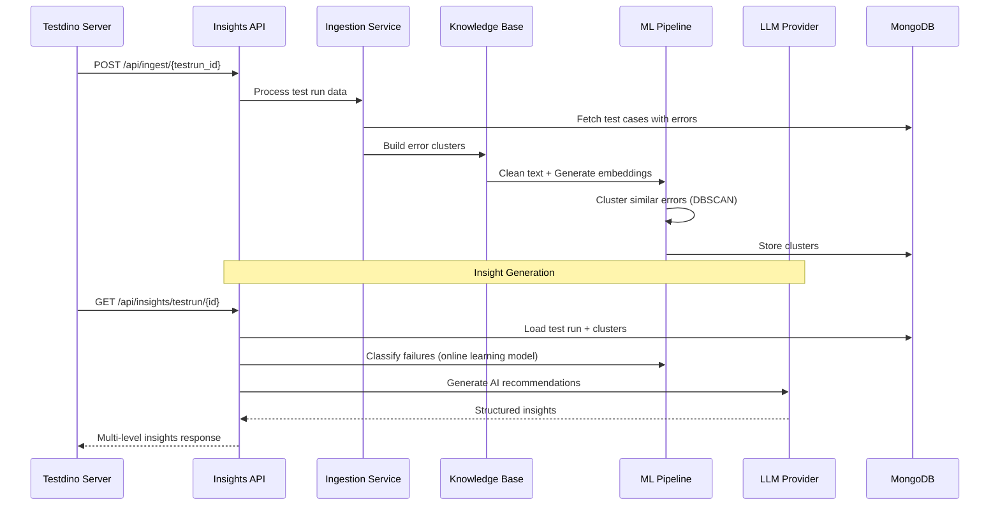
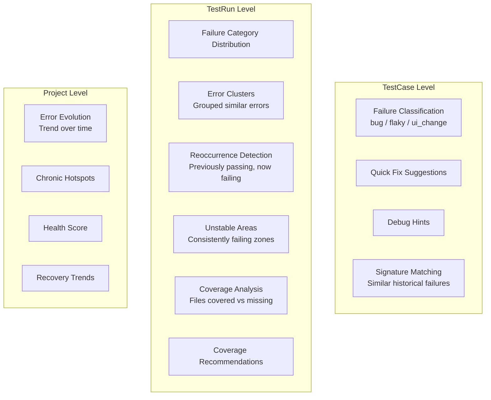
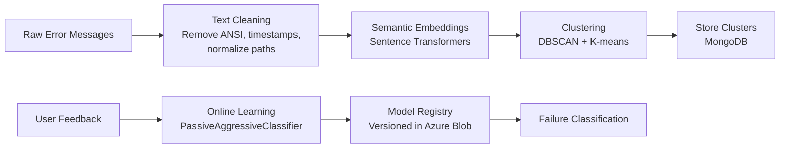

# Testdino Insights

The AI-powered analytics service for the Testdino platform. Performs error clustering, failure classification, and generates multi-level insights from test execution data using machine learning and LLMs.

## Tech Stack

| Layer | Technology |
|-------|-----------|
| Runtime | Python 3.12 |
| Framework | FastAPI 0.116 |
| Database | MongoDB via Motor 3.7 (async) |
| ML | scikit-learn 1.7, fastembed 0.7 |
| LLM | OpenAI / Azure OpenAI / Gemini |
| Embeddings | Sentence Transformers (llama-text-embed-v2) |
| Model Storage | Azure Blob Storage |
| Data | Pandas, Pydantic |

## Architecture



## Insight Generation Pipeline



## Project Structure

```
insights/
├── main.py                          # FastAPI entry point
├── config.py                        # Configuration management
├── requirements.txt                 # Python dependencies
│
├── knowledge_base/                  # Error clustering engine
│   ├── error_kb/
│   │   ├── builder.py               # Cluster vector construction
│   │   ├── cluster_utils.py         # Similarity & grouping
│   │   ├── text_cleaner.py          # Error message normalization
│   │   └── vector_service.py        # Vector operations
│   ├── ingestion_service.py         # Raw data ingestion
│   └── testflow_kb/                 # Test flow embeddings
│       ├── embed_flows.py
│       └── parser.py
│
├── insights_engine/                 # AI insight generation
│   ├── insights_controller.py       # Main orchestrator
│   ├── memory/
│   │   └── testrun_memory.py        # Test run memory management
│   ├── testcase_insights/           # Per-test-case analysis
│   │   ├── failure_category/        # ML failure classification
│   │   │   ├── main.py              # Online learning service
│   │   │   └── feature_build/       # Feature engineering
│   │   └── recommendations/         # AI-powered recommendations
│   │       ├── context_builder/     # Context assembly
│   │       └── service/             # LLM prompt + parsing
│   └── testrun_insights/            # Per-test-run analysis
│       ├── pattern_anomaly/         # Failure & performance patterns
│       ├── coverage_gap/            # Coverage analysis
│       └── unstable_areas_insight.py
│
├── storage/                         # Data persistence layer
│   ├── mongo_pool.py                # Connection pooling
│   ├── db_service.py                # Central DB dispatcher
│   ├── model_registry_db_service.py # ML model versioning
│   ├── azure_blob_model_storage_service.py
│   └── models.py                    # Pydantic data models
│
├── llm_core/                        # LLM abstraction layer
│   ├── providers/
│   │   └── llm_provider.py          # Multi-provider support
│   └── services/
│       ├── llm_service.py           # LLM orchestration
│       └── ai_cost_calculator.py    # Cost tracking
│
├── api/routes/                      # REST API endpoints
│   ├── ingestion.py                 # Data ingestion routes
│   ├── insights.py                  # Insight query routes
│   ├── failure_category.py          # Classification routes
│   └── recommendations_router.py    # Recommendation routes
│
├── logs/                            # Application logs
├── Dockerfile                       # Python 3.12 slim build
└── README.md
```

## Multi-Level Insights



### Test Case Insights

- **Failure Classification**: Online learning model (`PassiveAggressiveClassifier`) that classifies failures as `bug`, `flaky`, `ui_change`, or `unknown`. Continuously improves from user feedback.
- **Quick Fixes**: LLM-generated actionable fix suggestions with context from error messages, stack traces, and test history.
- **Debug Hints**: Contextual debugging guidance based on error patterns.
- **Signature Matching**: Finds historically similar failures using semantic embeddings.

### Test Run Insights

- **Error Clusters**: Groups similar error messages across the run, identifies newly introduced errors.
- **Failure Distribution**: Aggregated category breakdown across all failures.
- **Reoccurrences**: Detects tests that passed recently but are failing again.
- **Unstable Areas**: Highlights consistently underperforming application areas.
- **Coverage Analysis**: Assesses test file coverage and recommends missing files.

### Project Insights

- **Error Evolution**: Time-series analysis of error trends.
- **Chronic Hotspots**: Persistent problem areas across runs.
- **Health Score**: Overall project stability metric.

## ML Pipeline



**Key ML features**:
- Dynamic model refresh from registry (always latest version)
- Configurable similarity threshold (default 0.7)
- Feature engineering from error context, test history, and execution metadata
- Confidence scoring for every prediction
- Cost tracking for LLM API usage

## API Overview

| Endpoint | Method | Purpose |
|----------|--------|---------|
| `/health` | GET | Service health check |
| `/api/ingest/{testrun_id}` | POST | Ingest test run data and build clusters |
| `/api/insights/testrun/{id}` | GET | Full test run insights |
| `/api/insights/testcase/{id}` | GET | Individual test case insights |
| `/api/insights/project/{id}` | GET | Project-level insights |
| `/api/error-analysis/category-distribution/{id}` | GET | Failure category breakdown |
| `/api/error-analysis/predict-single/{id}` | GET | Single test case prediction |
| `/api/error-analysis/feedback` | POST | Submit classification feedback |
| `/api/error-analysis/retrain/{id}` | POST | Retrain model with feedback |
| `/api/recommendations/analyze` | POST | Batch recommendation analysis |
| `/api/recommendations/individuals/{run}/{case}` | GET | Per-test-case recommendations |
| `/api/recommendations/quick-fixes/{run}/{case}` | GET | Per-test-case quick fixes |

## Getting Started

1. Clone the repo and navigate to `insights/`
2. Create a `.env` file from the template below
3. Create a virtualenv with **Python 3.11 or 3.12** (recommended; 3.14 requires building scipy/sklearn from source). Then activate it and install dependencies:
   - `python3.12 -m venv venv` (or `python3.11 -m venv venv`), then `source venv/bin/activate` (Windows: `venv\Scripts\activate`), then `pip install -r requirements.txt`
   - If you only have a different Python: `python -m venv venv && source venv/bin/activate && pip install -r requirements.txt`
4. Ensure MongoDB is running
5. With the venv activated, run `python main.py` to start on port 8000 (or run `./venv/bin/python main.py` from the `insights/` directory)

### Key Environment Variables

| Variable | Purpose |
|----------|---------|
| `MONGODB_URI` | MongoDB connection string |
| `LLMPROVIDER` | LLM provider: `gemini` or `azure_openai` |
| `GEMINI_API_KEY` | Gemini API key (if using Gemini) |
| `AZURE_OPENAI_ENDPOINT` / `API_KEY` | Azure OpenAI credentials (if using Azure) |
| `AZURE_STORAGE_CONNECTION_STRING` | Azure Blob for model storage |
| `DEFAULT_SIMILARITY_THRESHOLD` | Clustering threshold (default 0.7) |
| `EMBEDDING_MODEL` | Embedding model name (default llama-text-embed-v2) |
| `MAX_CACHED_MODELS` | Max ML models in memory (default 2) |
| `MODEL_VERSION` | ML model version string |
| `LOG_LEVEL` | Logging level (default INFO) |

## Deployment

- **Docker**: Multi-stage Python 3.12 slim build
- **CI/CD**: GitHub Actions
- **Hosting**: Azure Container Apps
- **Async**: Fully async with Motor (MongoDB) and aiohttp
